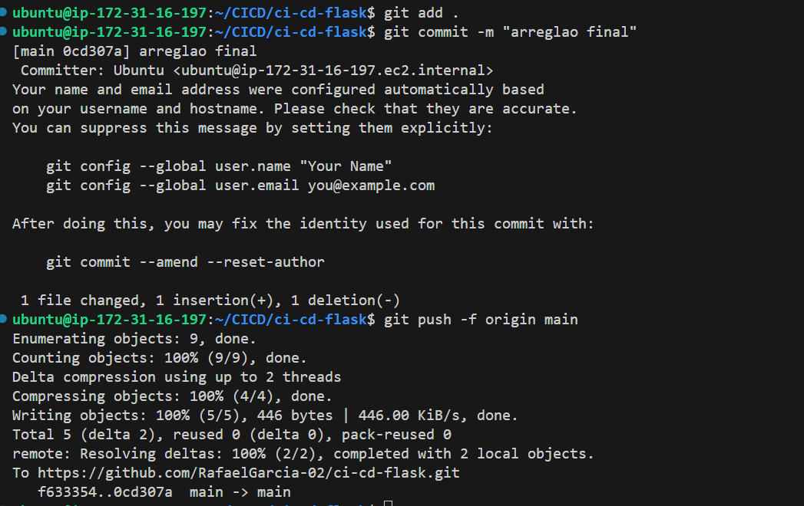

# ci-cd-flask

Este repositorio contiene los archivos necesarios para realizar una práctica de
**introducción a CI/CD** para una aplicación [Flask][1].

En esta práctica vamos a realizar las siguientes tareas.

- **Intregración Continua (CI) con GitHub Actions**. Vamos a automatizar la ejecución de
  tests unitarios cada vez que se haga un _push_ a la rama `main`.
- **Entrega Continua (CD)**. Vamos a automatizar la creación y publicación de
  una imagen Docker en Docker Hub cuando se pasen los test unitarios.
- **Despliegue Continuo (CD)**. Vamos a automatizar el despliegue de la imagen
  Docker en AWS.

## Cómo crear un virtualenv en Python

Creamos el entorno virtual.

```bash
python3 -m venv venv
```

Activamos el entorno virtual.

```bash
source venv/bin/activate
```

Instalamos las dependencias.

```bash
pip install -r requirements.txt
```

Para desactivar el entorno virtual.

```bash
deactivate
```


## Cómo ejecutar los tests

Para realizar los tests vamos a utilizar `unittest`, que es el framework de
pruebas unitarias que viene integrado en Python.

Desde la raíz del proyecto, ejecutamos el siguiente comando.

```bash
python3 -m unittest tests/*.py
```

Este comando ejecutará todos los tests que se encuentren en la carpeta `tests`.

[1]: https://flask.palletsprojects.com/en/stable/


## pasos de CICD 

### TOKENS de DOCKER 


### Git Hub secrets 

hemos tenido que modificar .yaml para poner un nuevo secret mas para AWS , AWS_SESSION_TOKEN

### creacion repositorio ERC 


### APP RUNNER 

hay un fallo por culpa de AWS , no me deja poner un nombre de rol de servicio 
ahi iria LabRole , es fallo de AWS no puedo hacer nada para arreglarlo 

### Realizar push ´


### Mostrar Git hub actions del repositorio 

me sale que ha fallado para AWS 

el error es debido a AWS Runner , pero se ha automatizado el proceso correctamente